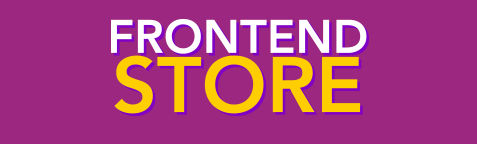
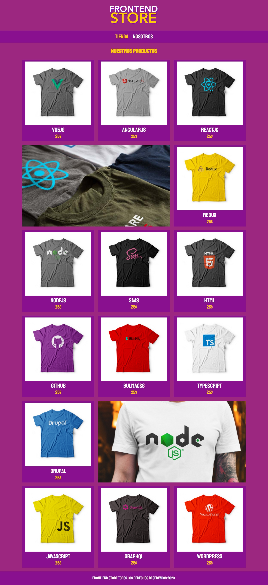
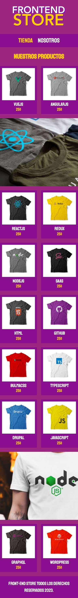

# Tienda de Ropa "DevTShirt Shop"

Bienvenidos a la página web de DevTShirt Shop, tu destino para la mejor selección de ropa con marcas de alta calidad. En FashionWeb, nos enorgullece ofrecer una amplia gama de productos de moda para todas las edades y géneros.

## Vista previa de la Página Web

### Versión para Desktop

### Versión para Mobile

## Características Destacadas

- Amplia selección de ropa de moda.
- Ropa de marcas de renombre.
- Navegación sencilla y amigable para el usuario.
- Compra en línea segura y fácil.
- Opciones de pago seguras y variadas.

## Cómo Usar DevTShirt Shop

1. Visita la [página de inicio de FashionWeb](https://leyva9.github.io/Static-Projects/techShirtsShop/index.html).
PD: Esta pagina aun esta en desarrollo

## Tecnologías Utilizadas

FashionWeb se ha desarrollado utilizando las siguientes tecnologías web:

- HTML5
- CSS3

## Equipo de Desarrollo

- [Luis Manuel Leyva-Hernández](https://github.com/Leyva9) - Desarrollador Frontend

## Contribuciones

¡Agradecemos las contribuciones de la comunidad! Si deseas contribuir a FashionWeb, por favor sigue estas pautas:

1. Abre un issue para discutir las nuevas características o problemas.
2. Realiza un fork del repositorio.
3. Crea una rama para tu contribución.
4. Trabaja en tu contribución.
5. Envía un pull request.

## Licencia

Este proyecto está bajo la Licencia MIT. Para más detalles, consulta el archivo [LICENSE](LICENSE).

¡Esperamos que disfrutes de tu experiencia de compra en DevTShirt Shop!
